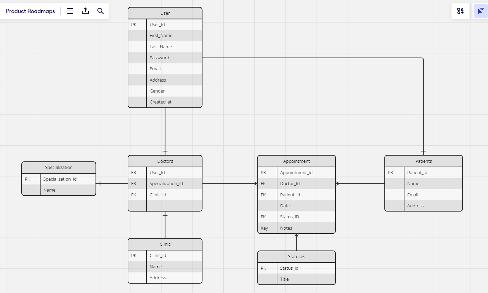

# Project made by
<a href="https://github.com/Eronate/Doctorphile/graphs/contributors">
  
</a>

# Run the project

```bash
npm install
npm install sequelize sqlite3
npx sequelize-cli db:migrate
```

